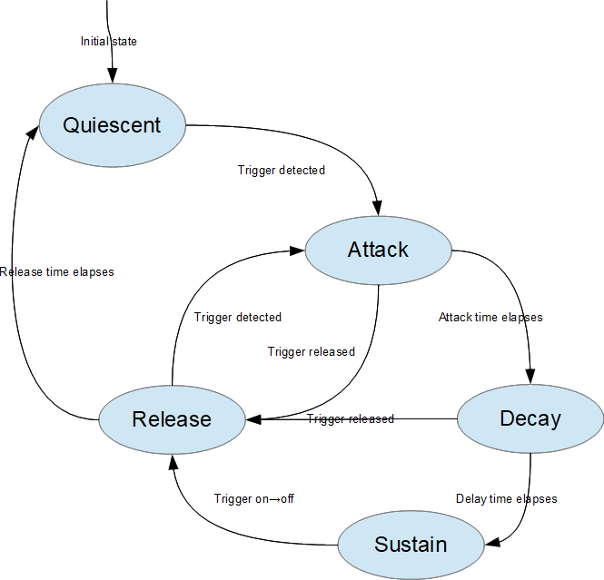

# ADSR Envelope
Generates an envelope in four stages: attack, decay, sustain, release. See [this wikipedia article](https://en.wikipedia.org/wiki/Envelope_(music)#ADSR) for more background.

## Parameters

### Peak Level
This is the maximum envelope value, reached at the end of the attack stage.

### Sustain Level
The envelope value that is held constant during the sustain stage.

### Attack Time
Time (seconds) to slew from 0 to the Peak Level. Must be positive.

### Decay Time
Time (seconds)  to slew from Peak Level to Sustain Level. Must be positive.

### Release Time
Time (seconds)  to slew from Sustain Level to 0. Must be positive.

## State Machine
The ADSR envelope generator uses a state machine (SM), as shown in this diagram.

### Quiescent
This is the initial state. The envelope output will always be zero. The SM remains in this state until a trigger is detected.

### Attack
This state is entered whenever a trigger is detected (trigger input transitions from off to on). In this state the output slews toward the peak level.

### Decay
In this state the output slews down from peak level to the sustain level. If the trigger is released, the SM switches to the Release state. If the trigger is held on the SM will change to the Sustain state after Decay Time has elapsed.

### Sustain
In this state the output is held constant. The SM stays in this state until trigger is released (trigger transitions from on to off).

### Release
In this state the output slews to 0, and then the SM changes back to the Quiescent state. If a trigger is detected before 0 is reached, the SM switches to the Attack state.

## Slew Rates
Slew rates are based on the attack, decay, and release times. If attack is triggered before the release stage completes then the attack will slew upward at the same rate as a normal attack. Likewise, if trigger is released before either the attack or decay stages have completed, then the output will slew down at the same rate as a normal release.
